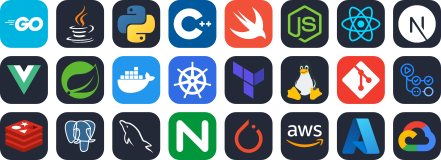

# Hey, I’m binaryYuki 👋  
**Building fast, reliable, AI-backed systems that actually scale.**  
I do backend + DevOps work that turns rough ideas into production-grade software.  
**Open to UK internships** — Backend / Platform / Infra.

---

## ⚙️ What I Build
- 🧠 **LLM-backed advice engine** with WebSocket **streaming** responses — p95 < 200 ms under load  
- 🧩 **Go + Gin microservices** with GORM, Atlas migrations, CI/CD, and blue-green deploys  
- 🛡️ Edge hardened with **Kong**, **Cloudflare** IP trust chain, and rate limiting → cut bad traffic by **90%+**  
- 🐳 **Container-first everything:** Docker, K8s, HPA, observability, and on-call readiness  

---

## 🧰 Toolbox

<!--  -->
  

  

---

## 📈 Activity & Stats

  <picture>
    <source
      media="(prefers-color-scheme: dark)"
      srcset="https://github-stats-extended.vercel.app/api?username=binaryyuki&theme=radical"
    />
    <source
      media="(prefers-color-scheme: light)"
      srcset="https://github-stats-extended.vercel.app/api?username=binaryyuki&theme=default"
    />
    
  </picture>

  <picture>
    <source srcset="./profile/top-langs.svg" media="(prefers-color-scheme: dark)" />
    
  </picture>

  
Contribution graph

  

---

## 📬 Get in Touch
- ✉️ hello [at] catyuki [dot] com  
- 💼 Looking for UK/Malta graduate roles (Backend / Platform / AI Infra)  
- 🕰️ Timezone: Europe/London  

---

Back to top ↑

